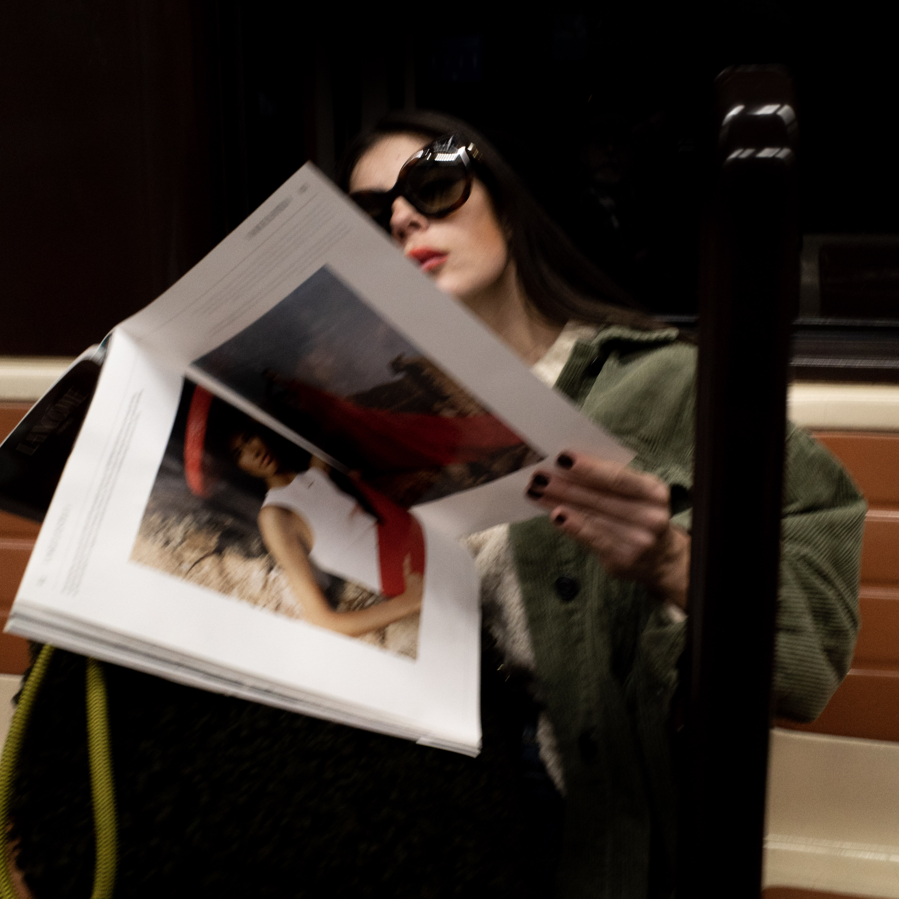
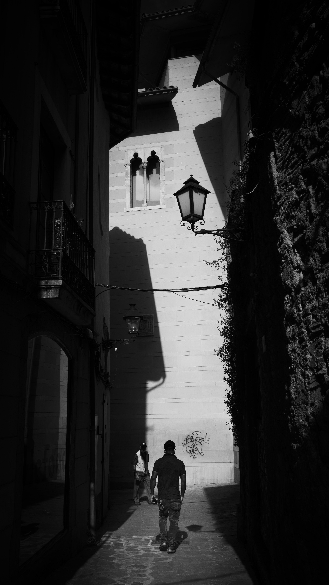

Abstract
--------

Generally, photography has been present in my life since I was a kid, now that I’m taking the craft more seriously, I’m starting to analyze my style amongst other things. This is a status update on the aforementioned topic.

Background
----------

My father got me into photography. He always liked the art, but he is a very cathodic, deliberate photographer. If he had to define his style in one short sentence, it would be: “I deliberately take one good shot”. This is a good approach for landscape photography, in which your subject is arguably more static than any other photographic styles. In fact, this is the photography style he likes best.

On the other hand, I have always photographed at a faster rate, focusing on moments with a subtle comedic tone. I am enamored with capturing common habits, daily routines or mundane yet extraordinary moments and situations. I started doing street photography before I knew there was a term for what I was doing. This is why Street Photography fits me like a glove.

Style
-----

A photographer’s style is a very important part of his or her identity. It’s the fist unconscious element a viewer focuses on in a frame, therefore a way to identify the given photographer.

I’m aware a photographer’s style is not immutable, but in my opinion, as the photographic mind matures, the photographer’s style settles down and a common theme starts to emerge. In my opinion, this is a sign of photographic mastery.

A quick response to this argument can be that a common trend is a sign of stillness and a lack of evolution, but in order to evolve, a photographer has to position himself in uneasy, uncomfortable situations. The contrary is a conformist settlement.

Although the above is totally true, I would argue that style transcends individual images or bodies of work. Rather, it’s the closest the public can be to the way the photographer sees the world. It’s the artist’s ultimate goal.

Given I’m just starting my adventures as a serious hobby photographer, I have identified only one more recent style change in my work.

Before, I focused on moments, leaving composition and aesthetics a bit behind.

This image is the perfect example. It expresses, better than I could ever describe in prose this person’s personality, interests, behavior and even presence. Alone, it tells her story in a way we can understand.

Now, I’m focusing on composition, light and shadows, with a touch of human element.

I think its compositionally more interesting but it lacks meaning. To find it, we would have to resort to a more ethereal, philosophical approach.

For example, a person, impure on his way to a castle made of light, dreams, ambitions and faith, crosses paths with a person returning from this castle of light, in white, purified clothes.

Although I have no idea why I see and focus more on these types of frames, one of the possibilities may have been provoked by the pandemic we are experiencing.

It’s very difficult to anticipate a moment if I can’t determine what or how a person is feeling. As a surgical mask makes this exercise noticeably more complicated.

Conclusion
----------

I acknowledge **I’m far from having a defined personal style**. Nevertheless, I am willing to work towards defining my own.

Only time and consistency will help in making this a reality.

