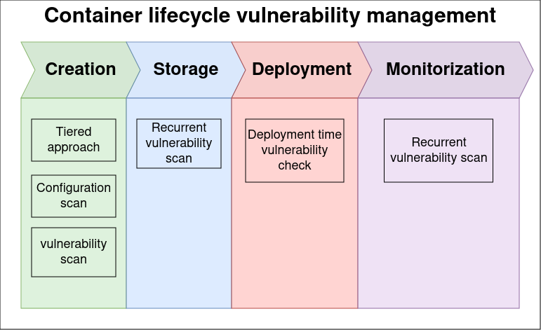

## Why did we develop this vulnerability management solution?

- To keep up with our fast development and deployment culture
- To ensure the applications we deploy meet the security standards we seek

As AppSec engineers working with [Kubernetes](https://kubernetes.io/), one of the main points we must consider when developing a vulnerability management solution is the container lifecycle. From image creation to image monitorization in a [Kubernetes](https://kubernetes.io/) cluster.

There are four general stages in this lifecycle that can introduce vulnerabilities and misconfigurations, and our task is to ensure that developers can create and use secure functional images and automate security into every stage. The image below illustrates some of the checks that can be done, we will now have to decide what tools or systems we implement at every stage to cover every attack vector.

As we can see, every stage has a vulnerability check. This may seem strange, but we will cover why it is important to obtain a truly zero-trust container lifecycle vulnerability management solution. 

## How we determined the necessary tools or systems

We created a vulnerability matrix that contains all the possible ways we could think of in which a vulnerability may be introduced into the container throughout its lifecycle. Below is the matrix. Let us look at what each term means.

| image type \ image use | Conventional deployment | Unconventional deployment | Post-deployment new vulnerabilities |
| --- | --- | --- | --- |
| Known image |                          ✅ |                           ✅ |                          ✅ |
| Unknown image |                          ✅ |                           ✅ |                          ✅ |

A **known image** is an image that has undergone CI (Continuous Integration) checks at creation time we have in place, ensuring that it surpasses our security appetite and therefore can be deployed in an environment. These checks include the use of [Trivy](https://aquasecurity.github.io/trivy/v0.52/) image scanner to check for vulnerabilities as well as the analysis of the image’s Dockerfile to detect security miss configurations. All known images are stored in an [ECR](https://aws.amazon.com/ecr/) (Elastic Container Registry), where they are continuously scanned with [AWS](https://aws.amazon.com/) (Amazon Web Services) [Inspector2](https://aws.amazon.com/inspector/) to check if new vulnerabilities are found while they are available for use in our [ECR](https://aws.amazon.com/ecr/).

An **unknown image** is an image stored in a [public registry](https://hub.docker.com/) that does not necessarily meet our security standards. Although it might, we have not analyzed it, and most importantly, cannot alter it, as we do not own it.

A **conventional deployment** is one which undergoes the automated [GitOps](https://www.gitops.tech/) process of deployment. As part of this deployment, an image is created and analyzed for vulnerabilities and miss configurations. It is very unlikely that a conventional deployment created from our own code repositories contains an unknown image. There is however one use-case where this happens. External deployment dependencies, like databases, or sidecars. They are included in the deployment specification at CD (Continuous Deployment) time. At this stage, we cannot scan these images in CI, so we must account for them more manually. To use these images as safely as possible in our workflow, we add them to [ECR](https://aws.amazon.com/ecr/) using a [Pull-through cache](https://docs.aws.amazon.com/AmazonECR/latest/userguide/pull-through-cache.html), converting them into known images.

An **unconventional deployment** is considered to be one that does not follow any CI or CD process. An example of such a deployment might be a scenario in which a human operator with sufficient permissions connects to one of our [EKS](https://aws.amazon.com/eks/) (Elastic [Kubernetes](https://kubernetes.io/) Service) clusters and deploys applications for testing purposes or debugging purposes.

Having analyzed these vulnerability vectors, we look for solutions that can cover all vulnerability vectors in unison. It is most probable that no single tool will be able to cover all vulnerability vectors, but combining different tools, we can cover the whole container lifecycle.

## Multi-tiered images and secure defaults

This is the first line of defense. It deserves an honorary mention, but it does not directly contribute to reducing the vulnerabilities images might have. The general rule of thumb is:

- Use the smallest possible image available that can do your job
- Build containers using secure default configurations

## CI and ECR image scanning

Once the container is configured in a [Dockerfile](https://docs.docker.com/reference/dockerfile/), it is built and scanned to check for vulnerabilities before it is uploaded. We can see in the table below how it is the only - but arguably the most important - use case this system covers. 

### Attack vector coverage

| image type \ image use | Conventional deployment | Unconventional deployment | Post-deployment new vulnerabilities |
| --- | --- | --- | --- |
| Known image |                          ✅ |                           ❌ |                          ❌ |
| Unknown image |                          ❌ |                           ❌ |                          ❌ |

With [ECR](https://aws.amazon.com/ecr/) registry scans and CI image scans we can have complete control of known images that are being deployed in a conventional manner. 

It may be a good idea to create an image retention policy and ensure that all teams know about this policy, otherwise, removing deprecated images from [ECR](https://aws.amazon.com/ecr/) might be a risky move. 

If there is a retention policy of 0 backup images, then the broken application will remain broken, and a CI/CD process should be spun up again to deploy the previous image into production. This is the most secure way to operate, but it’s not agile. If there is a retention policy of 1 image, then we can swap the deployment to the previous image if there are errors in the new image and maintain traffic and availability. Notice that the more image versions that are stored, the less secure the registry becomes, as images stored there have greater probability of accumulating vulnerabilities, and teams responsible in updating them will eventually stop doing so. This is why it’s important to establish a retention policy with application teams.

The point in the matrix that is covered by this use case, is “known image / unconventional deployment”, where we are sure to have scanned the image that is going to be deployed, but we cannot control if it is deployed or not at this stage in the SDLC.

All other vulnerability vectors are impossible to control with [ECR](https://aws.amazon.com/ecr/) and CI scans, let us see what technologies we used to solve them.

### Technologies you might use

- [ECR](https://aws.amazon.com/ecr/)
- [Trivy](https://aquasecurity.github.io/trivy/v0.52/)
- [Inspector2](https://aws.amazon.com/inspector/)

You can set up a CI that scans images with [Trivy](https://aquasecurity.github.io/trivy/v0.52/). In my opinion it is the best vulnerability scanner out there. If the scan is successful, the CI will upload the container image to [ECR](https://aws.amazon.com/ecr/), where they will be continuously scanned with [AWS](https://aws.amazon.com/) [Inspector2](https://aws.amazon.com/inspector/), ensuring images remain compliant. If images cease to be compliant, either the security team or the application maintainers receive a notification prompting them to delete or update the image. The notification system can be built with [SNS](https://docs.aws.amazon.com/sns/latest/dg/welcome.html) and [lambda](https://aws.amazon.com/lambda/) functions.

## Vulnerable image deployment prevention

This system covers the widest range of options, as it checks every deployment that is requested to the [Kubernetes](https://kubernetes.io/) API.

It is also the most complicated to set up. We decided to implement a custom [mutating webhook](https://kubernetes.io/docs/reference/access-authn-authz/admission-controllers/#mutatingadmissionwebhook), so we could add the vulnerability information to the deployment images. 

### Attack vector coverage

| image type \ image use | Conventional deployment | Unconventional deployment | Post-deployment new vulnerabilities |
| --- | --- | --- | --- |
| Known image |                          ✅ |                           ✅ |                          ❌ |
| Unknown image |                          ✅ |                           ✅ |                          ❌ |

This vulnerability prevention solution that combines a [mutating](https://kubernetes.io/docs/reference/access-authn-authz/admission-controllers/#mutatingadmissionwebhook) and a [validating](https://kubernetes.io/docs/reference/access-authn-authz/admission-controllers/#validatingadmissionwebhook) [admission controller](https://kubernetes.io/docs/reference/access-authn-authz/admission-controllers/), accounts for most use cases. We can cover **unknown images in a conventional and unconventional deployment** by creating a [policy](https://www.openpolicyagent.org/docs/latest/policy-language/) that allows or denies their creation. It is also possible to block the deployment of an unknown image until it is scanned by a tool like [Trivy](https://aquasecurity.github.io/trivy/v0.52/).

Our strategy is to deny unknown image deployments and use [ECR](https://aws.amazon.com/ecr/)’s [pull-through cache](https://docs.aws.amazon.com/AmazonECR/latest/userguide/pull-through-cache.html) to add allowed external images into [ECR](https://aws.amazon.com/ecr/), converting them into known images.

It is important to note that we rely on [ECR](https://aws.amazon.com/ecr/) known image vulnerability scans to allow or deny an image from being deployed, therefore for this system to work, it requires an external registry API, so we can query it for container vulnerabilities.

### Technologies you might use

- [OPA Gatekeeper](https://open-policy-agent.github.io/gatekeeper/website/)
- Custom [mutating admission controller](https://kubernetes.io/docs/reference/access-authn-authz/admission-controllers/#mutatingadmissionwebhook)
- [ECR](https://aws.amazon.com/ecr/)

Create a custom [mutating admission controller](https://kubernetes.io/docs/reference/access-authn-authz/admission-controllers/#mutatingadmissionwebhook) that queries [ECR](https://aws.amazon.com/ecr/) [API](https://docs.aws.amazon.com/AmazonECR/latest/APIReference/API_ImageScanFindings.html) for known images and adds (mutates) the image’s own vulnerabilities as annotations into the deployment. Then use [OPA Gatekeeper](https://open-policy-agent.github.io/gatekeeper/website/) (Validation admission controller) to check that the images being deployed meet the security requirements we feel comfortable with. Do this by creating [Rego policies](https://www.openpolicyagent.org/docs/latest/policy-language/). Besides checking for vulnerabilities, you could also check for deployment misconfiguration like not setting CPU and Memory limits.

[OPA Gatekeeper](https://open-policy-agent.github.io/gatekeeper/website/) is a policy engine that can be used by any department that wants to ensure deployments meet their standards. It may be used by the infrastructure team, to ensure teams deploy with [resource restriction rules](https://kubernetes.io/docs/concepts/configuration/manage-resources-containers/), or by the SRE team, to ensure deployments include [Liveness and readiness probes](https://kubernetes.io/docs/tasks/configure-pod-container/configure-liveness-readiness-startup-probes/).

## Deployed image vulnerability detection

### Attack vector coverage

| image type \ image use | Conventional deployment | Unconventional deployment | Post-deployment new vulnerabilities |
| --- | --- | --- | --- |
| Known image |                          ❌ |                           ❌ |                          ✅ |
| Unknown image |                          ❌ |                           ❌ |                          ✅ |

This final scan is important because it checks for vulnerabilities in deployed container images. It is most usual to find new vulnerabilities in already deployed images due to researchers and hackers alike finding new vulnerabilities in packages and dependencies that are included in the container image that has been deployed.

As a secondary feature, having a tool that scans for vulnerabilities on installed software provides an inventory of known applications and vulnerabilities that are currently deployed in the cluster.

### Technologies you might use

- [Trivy-operator](https://aquasecurity.github.io/trivy-operator/latest/)

This application scans the deployed images and adds the scan results as a [CRD](https://kubernetes.io/docs/tasks/extend-kubernetes/custom-resources/custom-resource-definitions/) (Custom Resource Definitions) into the deployment or application being scanned. You can later gather all the insights obtained and produce a dashboard with the vulnerabilities in the cluster. 

## Conclusion

By creating a vulnerability matrix that maps out possible attack vectors, we can increase the awareness of our security posture. The specific tools suggested in this article might fit your needs, but if not, the matrix will always allow you to take an informed decision on what tools you need to cover a specific attack vector.
