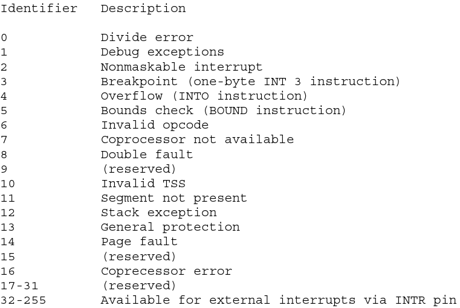
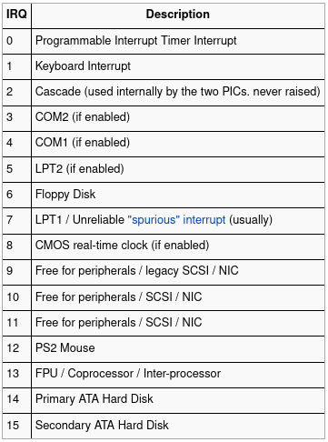

Once I have created a Kernel with subsequent `print()` methods and the GDT, my next step in creating a OS is to implement Interrupts. We are going to enable Interrupts and write a keyboard interrupt handler for my learning-purposes OS called [Rose-OS](https://github.com/SergioRosello/Rose-OS).

> This document is a resume of [this OSDEV wiki article](https://wiki.osdev.org/Interrupts), [this osdever article](http://www.osdever.net/bkerndev/Docs/idt.htm) and the [Intel i386 processor manual](https://css.csail.mit.edu/6.858/2015/readings/i386.pdf).

## But, What are Interrupts?

Interrupts are signals from a devices to the CPU. They are used to tell the CPU to stop the process it is executing and immediately switch to something else.

To put a specific example, when a keyboard key is pressed, a specific memory address in the processor is activated. This is represented by a table provided by the OS called the IDT (Interrupt Descriptor Table) and jumps to the code the entry points to. This code is called ISR (Interrupt Service Routine) or Interrupt Handler.
Types of Exceptions

## There are generally 3 different types of interrupts:


* **Exceptions:** Generated internally by the CPU; Used to alert the Kernel of an event or situation that needs attention.
* **IRQ (Interrupt ReQuests):** Interrupt generated externally by the chipset. There are two types: Pin-based and Message based.
* **Software Interrupt:** Interrupt signaled by software indicating to the Kernel it needs the Kernel’s attention.


## Interrupts, from start to end

The CPU checks the PIC pin for a interrupt every time it completes a instruction.

1. Keyboard key is pressed
1. Keyboard controller tells a device (PIC Programmable Interrupt Controller) to cause a interrupt
1. IRQ #1 is sent to the PIC
1. PIC decides whether the CPU should be immediately notified of the IRQ
1. PIC converts the IRQ into a interrupt vector (Number between 0 and 255) for the CPU’s table
1. The PIC has notified an interrupt, so the CPU stores some state information on the stack and jumps to the address pointed to by the IDT
1. The code pointed to by the IDT handles the interrupt (Via the Interrupt Handler, setup in advance by the OS) by interacting with the keyboard via `in/out` instructions
1. Once the code has finished interacting with the device, it executes a `iret` command, to re-set the state the processor was in before the interrupt was handled.

## Enabling Interrupts

The first 32 interrupts are reserved by the processor, these are showed in the table below:



## Interrupt and exception ID assignments

We can manage the interrupts from 32 to 255. We only have 16 interrupt pins available to us by the processor. These pins are located in the two PIC (Programmable Interrupt Controllers) and are read based on priority. The highest priority interrupt is IRQ0 and the lowest priority is interrupt IRQ7. This is due to the IRQ2, or cascade interrupt, which is used to read interrupts IRQ8-IRQ15 from slave PIC.



So the order of the IRQ priority goes like this:

`IRQ0, IRQ1, IRQ8, IRQ9, IRQ10, IRQ11, IRQ12, IRQ13, IRQ14, IRQ15, IRQ3, IRQ4, IRQ5, IRQ6, IRQ7`

Knowing this, we have to map each interrupt to its interrupt handler, so we will have 16 interrupt handlers.

In this example, we will see the keyboard interrupt handler, given that it’s the one we are going to write the actual handler function for.

As always, we start from our main function. Note we are going to load interrupts, print a welcome message, and start a endless loop.

If Interrupts weren’t working, we could not manage our system once the program flow enters the loop.

```C
// Kernel/kernel.c
#include "../drivers/screen.h"
#include "idt.h"

void main(){
  // Load Interrupts
  idt_init();
  // With this meesage, what I am trying to acheve is to debug method handle_scrolling.
  print("Welcome to Rose-OS\n");
  // Check weather interrupts are in place or not
  while(1){}
}
```

Here, we have defined a interrupt entry structure:

```C
// kernel/idt.h
struct idt_entry {
  unsigned short int offset_lowerbits;
  unsigned short int selector;     // Kernel segment goes here
  unsigned char zero;              // Always zero
  unsigned char type_attr;         // Flags set using the table
  unsigned short int offset_higherbits;
} __attribute__ ((packed));

struct idt_ptr {
  unsigned short limit;
  unsigned int base;
} __attribute__ ((packed));
```

And we create a array for 256 entries, creating a interrupt vector. We are going to create the definitions of some external methods (`irq0`) written in `asm` and their addresses (`irq0address`) to fill in the `IDT` correctly in the linkage phase. This way, we are populating the `IDT` with the address of the external interrupt handler method (programmed in `asm`) that, in turn, calls a `IRQ` handler function for each interrupt (written in `C`).

```C
// idt_init() method on kernel/idt.c 
void idt_init(){
  struct idt_entry IDT[IDT_SIZE];

  extern int load_idt();
  // Keyboard Interrupt Handler method
  // written in /boot/irq.asm
  extern int irq1();
  // The address of the asm method, to populate the idt_entry vector number 33.
  unsigned long irq1_address;

  // Initialize the PIC chips
  // The specific code can be found in my github repo
  // Not necessary for this overview

  // Populating the idt_entry vector for the keyboard interrupt
  irq1_address = (unsigned long)irq1; 
  IDT[33].offset_lowerbits = irq1_address & 0xffff;
  IDT[33].selector = 0x08; /* KERNEL_CODE_SEGMENT_OFFSET */
  IDT[33].zero = 0;
  IDT[33].type_attr = 0x8e; /* INTERRUPT_GATE */
  IDT[33].offset_higherbits = (irq1_address & 0xffff0000) >> 16;

  // fill the IDT descriptor 
  idt_address = (unsigned long)IDT ;
  idt_ptr[0] = (sizeof (struct idt_entry) * 256) + ((idt_address & 0xffff) << 16);
  idt_ptr[1] = idt_address >> 16 ;

  // Finally, call the asm method to initialize the IDT
  load_idt(idt_ptr);
}
```

The `asm` method written to handle `IRQ1` will be:

```
; section of /boot/irq.asm
irq1:
  pushad
  cld
  call irq1_handler ; Keyboard handler
  popad
  iretd
```

For all of this to work, we have to call the `asm` instruction `lidt` with the `IDT` address as a parameter. We have declared this method as `extern` because it is written in `asm`. Here is the method:

```
load_idt:
	mov edx, [esp + 4]
	lidt [edx] ; Load IDT
	sti ; Set interrupt flag
	ret
```

In the above method, we are collecting the parameter passed to it through the `esp` register. Most importantly, we are loading the `IDT` table with the address of the new `idt_entry` vector initialized in `kernel/idt.c`.

Now, we have finished enabling Interrupts and assigning the interrupt table.
Writing the keyboard handler (`irq1_handler()`)

Now, when a keyboard key is pressed, the keyboard controller sends a pulse that sets the `IRQ1` pin. This is interpreted by the `PIC` controllers and the specific interrupt method’s memory address is looked up in the `IDT`. In this case, it’s the `irq1` method (Implemented in `boot/irq.asm`) the one that gets executed. This method pushes all general purpose registers, clears the direction flags, calls the `irq1_handler` method (Implemented in `drivers/keyboard.c`), pops all the general purpose registers and restores the required parts of the `EFLAGS`.

## irq1_handler()

This method simply calls that specific interrupt handler, in our case, the keyboard handler, and signals `EOI` (End Of Input acknowledgment) to the `PIC`’s command port. As we are writing the `IRQ1` (keyboard) interrupt handler, and this is interpreted by the `PIC1`, we have to write the `EOI` byte to the pin `0x20`. If we don’t signal `EOI`, the `PIC` won’t allow further Interrupt Requests.

```C
// kernel/irq1_handlers.c

void irq1_handler(void) {
  keyborad_handler();
  port_byte_out(0x20, 0x20); //EOI
}
```

## keyboard_handler()

To be able to read the pressed key from the keyboard, we have to read the keyboard’s output buffer. There, we can find the data, in hex, that corresponds to the keyboard’s key press.

We have to be careful when we read from this pin, because, once we read, it’s buffer gets erased, in preparation for the next key press. Also, we can read port `0x64`, which is the status port, to get information on the `0x60` port. There is a flag, called `OBF` (Output Buffer Full) that indicates whether we can read from data port or not.

Once we have checked the `OBF` flag, and it assures us we can read from port `0x60`, we can proceed with mapping the data read with the key pressed. As strange as it may seem, I defined and initialized `keyboard_map` in a separate `.h` file, but for some strange reason, when we tried to access some of it’s elements, we where returned garbage. For this reason, I decided to declare every time this code gets run, which is, in my opinion, way too inefficient and not very elegant.

```C
// drivers/keyboard.c
    
void keyborad_handler(){
  // Read keyboard status
  const unsigned char status = port_byte_in(READ_STATUS_REGISTER);
  // TODO: Why has the keyboard_map have to be here!
  // I cant declare in .h and use here.
  // Figure out why.
  char keyboard_map[86] = {
    0, 27, '1', '2', '3', '4', '5', '6', '7', '8', 
    '9', '0', '-', '=', '\b', '\t', 'q', 'w', 'e', 'r', 
    't', 'y', 'u', 'i', 'o', 'p', '[', ']', '\n', 0, 
    'a', 's', 'd', 'f', 'g', 'h', 'j', 'k', 'l', ';', 
    '\'', '`', 0, '\\', 'z', 'x', 'c', 'v', 'b', 'n', 
    'm', ',', '.', '/', 0, 0, 0, ' ', 0, 0, 
    0, 0, 0, 0, 0, 0, 0, 0, 0, 0, 
    0, '7', '8', '9', '-', '4', '5', '6', '+', '1', 
    '2', '3', '0', '.', 0, 0
  };
//  Bit 0: Output buffer status
    //0: Output buffer empty, don't read yet. 
    //1: Output buffer full, can be read. 
  if (status & 0x01) {
    const char symbol = port_byte_in(READ_OUTPUT_BUFFER);
    // If interrupt keyboard data is a make (pressed key) 
    if (symbol < 86 && symbol > 0) {
      print_c(keyboard_map[symbol]);
    }
  }
}
```

When the function gets called, we check whether it’s a key press or a key release interrupt by checking the symbol value. If it’s a key press, we print the mapped value.
Conclusion

There is a lot to get our heads around in this post. There is a even greater amount of implementation to be done, at least, having a default Interrupt handler, so that an-implemented interrupts are handled gracefully. But this is the bare bones implementation of interrupts and a keyboard interrupt handler method.

