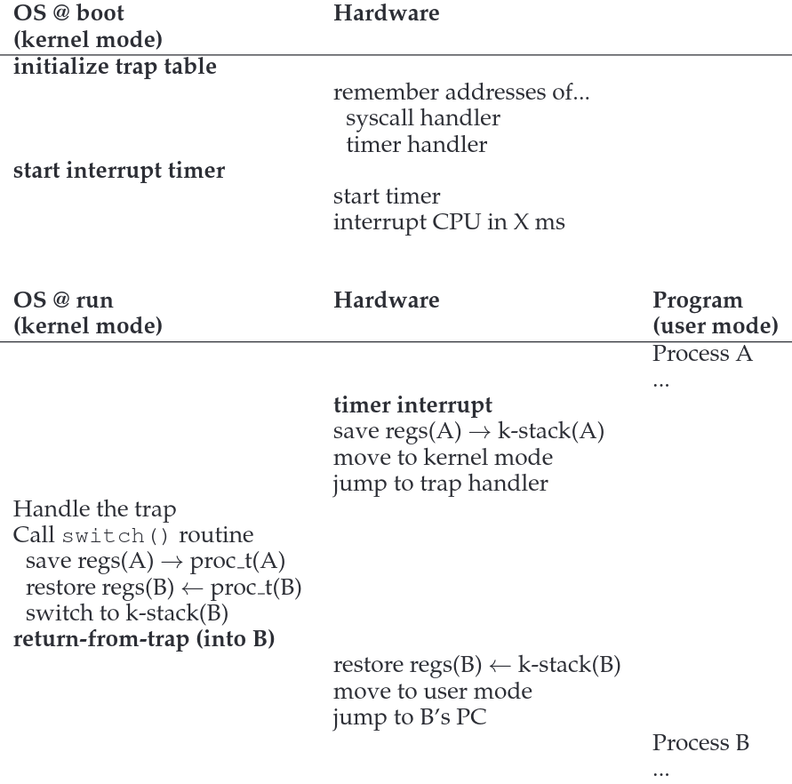

There are many problems associated with virtualizing a CPU. The most important problem we have to solve is that **we need to maintain control of the processes running, so they don’t take over the system**. Other problems such as the need to switch environments and resources for every different process the CPU works on, also impact CPU efficiency.

Basic Technique: Limited Direct Execution
-----------------------------------------

Direct execution: The Operating System provides access to the CPU directly to each process. The operating system is in charge of setting the environment and transferring control to the process `main()` entry point and regains access when the process exits.

This generates a couple of questions, for example: How do we know the process is benign? We have no control. How does the Operating System stop the currently running process in order to time-share the CPU?

Without limits, the Operating System would just be a library, with no control of underlining hardware.

Problem 1: Restricted Operations
--------------------------------

Given we can’t execute code in the processor without any control over it, we have created a new layer of abstraction. The processor has several modes it can run in.

*   Code that runs in **User Mode** is restricted in what it can do.
    
*   Code that runs in **Kernel Mode** is unrestricted, and the process can do what it likes. Ideally, only the Operating System / Kernel runs in this mode.
    

If a program running in User Mode needs to perform some kind of privileged operation, the hardware vendor provides **System call** capabilities. System calls allow the kernel to expose key pieces of functionality to user programs.

The POSIX standard defines a series of calls (+- 100) to enable and standardize communication between the Operating System and the Application. Some examples:

*   Creating and destroying processes
*   Communicating with other processes
*   Allocating more memory
*   Functions to **trap** into the kernel and back out again (**return-from-trap**).

There is a special case we haven’t considered yet. If the programs execute in **User mode** and cant access specific protected locations, only available to **Kernel mode**, how do **trap**s work?

The idea is that when the OS is booting, and still is in Kernel mode, it tells the hardware where it is going to store the **trap table**, which is a table that tells the hardware which code to load when a specific interrupt occours.

Imagine it’s a sort of translator (From interrupt to hardware). Each system call has a specific system call number, which the hardware already knows where its code is at. The user code is then responsible of placing this number in a specific location on a register or stack.

This prevents the system call from specifying a location where the code is going to be, ensuring the OS only executes known code.

When the return-from-trap function is executed, the OS handles control back to the process that entered trap mode. The process then finishes it’s work and returns from `main()`.

Problem 2: Switching Between Processes
--------------------------------------

The problem resides in that if a process is running on the CPU, the OS isn’t running, therefore, we can’t re-gain control of the CPU. So, **How can a OS regain control of the CPU so that it can switch between processes?**

To solve this, we have two approaches:

### Cooperative approach: Wait for System Calls

In a cooperative scheduling system, the OS regains control of the CPU by waiting for a system call or an illegal operation of some kind to take place.

Most processes transfer control to the OS fairly frequently. When the process creates a system call, it will transfer control to the OS.

If the process manages to perform any illegal operation, such as dividing by 0 or accessing reserved memory, the OS will also regain control.

If a process hangs, in a infinite loop, the only way to transfer control back to the OS is to reboot the machine.

### Non-Cooperative approach: The OS Takes Control

Without hardware help, we can’t regain control of a running process.

The only way to regain control is with a **Timer interrupt**. A timer device raises a interrupt every X milliseconds.

When the interrupt is raised, the current process pauses, it’s registers are stored in a hardware register stack and a pre-configured interrupt-handler in the OS is run.

In order to do this, the OS must inform the hardware of which code to run when the timer interrupt occours. This is done at boot sequence, while we are running in **Kernel Mode**.

### Saving and Restoring Context

When the interrupt occours, the OS has to decide whether it wants to continue executing the previous process or it wants to give control to another process. This task is managed by the **Scheduler**.

If the decision is made to switch, the OS executes a low-level piece of code known as the **Context switcher**.

This code saves register values of the process being executed onto its kernel stack and restores other register values for the process to be run once the **return-from-trap** instruction is executed.

The image below illustrates the Limited Direct Execution Protocol.

