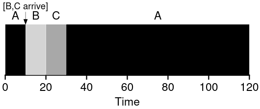
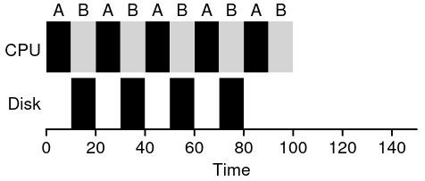

Scheduling is the policy we use to arrange the processes the CPU has to run and when.

In this post, we are going to look into some basic scheduling techniques examples.

## Workload assumptions

We are going to set a series of assumptions about the processes running in the system:

1. Each job runs for the same amount of time
1. All jobs arrive at the same time
1. Once started, each job runs to completion
1. All jobs only run on CPU (No I/O)
1. The runtime of each job is known

## Scheduling metrics

We are going to use these metrics to compare the different scheduling techniques.

The Turnaround time is time at which the job completes minus the time at which the job arrived at the system.

> **T**turnarround = **T**Completion - **T**arrival

This metric is a performance-based metric. There are other ways of metering scheduling policies. Fairness metrics (Measured by **Jain’s Fairness Index**), are one of them. As usual, it is complicated to achieve a scheduling techniques that performs well at performance and at fairness.
Scheduling Techniques

Below is a compilation of several scheduling techniques, from simplest to most complex.
FIFO (First In, First Out)

Called FIFO or FCFS (First Come, First Serve)

If we have 3 jobs, all of them take 10s to complete, the average turnaround is 20.

> (10 + 20 + 30) / 3 = 20.

This is a good and efficient scheduling technique, but when we realize there are jobs that take up much more CPU resources than others, we see that the average turnaround time for these processes increases in a directly proportional manner.

Imagine we have one job that takes up 100s to complete.

> (100 + 110 + 120) / 3 = 110.

All the other processes suffer from this big one. This is called the **Convoy effect**.

## SJF (Shortest Job First)

This technique runs first the job with lowest perceived time to completion.

It runs the shortest job first, then the next shortest, and so on.

Using the latest scheduling example:

> (10 + 20 + 120) / 3 = 50.

The efficiency difference is more than double the result from FIFO.

Now imagine jobs can arrive at different times to be run, and not all at once. The largest job can come first. If this happens, we are in the same situation as FCFS implementation, where smaller jobs can be completed much earlier that the current process.

## STCF (Shortest Time-To-Completion First)

Also known as the (PSJF) Preemptive Shortest Job First.

Is a **preemptive** scheduler which adds preemption to the shortest job first scheduling technique. It can preempt a job and decide to run another. Any time a new process enters the system, the scheduler determines how much time it will take to complete and orders all the processes from fastest to slowest and runs the process with less time to complete remaining.

## STCF

Calculating the metric:

> (120 - 0) + (20 - 10) + (30 - 20) / 3 = 50

We have now arrived at the fastest scheduler, but what about the fairness? This metric worked great when user input was not a factor to take into consideration. Now, we have to take into consideration user I/O.

## Response Time

This new **Metric** is defined as the time from when the job arrives in the system to the first time it is scheduled.

> **T**response = **T**firstrun - **T**arrival

It is important because user input has to be prioritized, so that the user can receive visual feedback of what he is doing.

## (RR) Round Robyn

Round Robin solves this issue by executing the processes for a **time slice** or **scheduling quantum** and then switches to the next job in the run queue. It repeatedly does so until the jobs are finished. (The length of the time slice must be a multiple of the [timer-interrupt period](https://sergiorosello.com/posts/operatingsystems-threeeasypeaces-mechanism-limited-direct-execution/))

In Round Robin, the shorter the time slice, the better the performance of the scheduler, but if we take into account context switching, we have to realize this operation also takes time to complete. Therefore a good **RR** scheduler compromises between context switching and process scheduling quantum to achieve optimum performance without rendering the system unresponsive.

As good as Round Robin is if we base our metrics on response time, it is not as good with turnaround time. This is because RR (A **fair** policy) evenly distributes its processes, expanding their execution time to ensure execution as soon as possible.

Therefore:

> If you are willing to be unfair, you can run shorter jobs to completion, but at the cost of response time; If you instead value fairness, response time is lowered, but at the cost of turnaround time.

## Incorporating I/O

If we incorporate I/O, we have to realize the currently-running process wont be needing the CPU because it’s blocked waiting for I/O completion. When the I/O finishes, it issues a interrupt, and the process state has to change from blocked to ready state. It also has to decide weather to run the job or not.

One common way of arranging this is by sub-dividing the I/O job.

Imagine we have two processes:

* A and B each need 50ms to complete.
* A runs 10ms on CPU and then issues I/O which also takes 10ms.
* B does not issue any CPU interrupts.

If we sub-divide each of A’s 10ms CPU time slots, as we are using a STCF scheduler, the scheduler will prioritize these over B’s 50ms time slot, and therefore interrupt B while running to allow A to execute. This method prevents CPU process time wastage as it will schedule B when A has issued a I/O interrupt and re-schedule A when the timer interrupt takes place.

