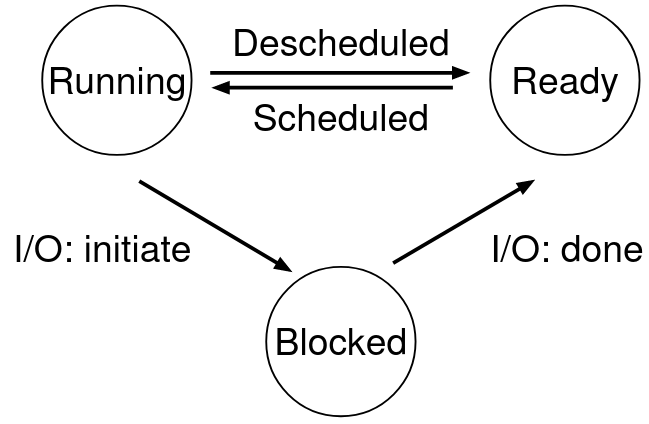

This series contains my notes on the free on line book [Operating Systems: Three easy pieces](http://pages.cs.wisc.edu/~remzi/OSTEP/).

As a user wants to be able to run multiple processes at once, we have to be able to create the illusion that there are as many processors as each program needs. The OS does this by **virtualizing** the CPU. (Executing instructions from one process and then changes to another program) This allows multiple programs to run at once. The downside is that performance is impacted.

To implement virtualization, we need both low-level machinery, called **mechanisms** and high-level intelligence or **policies**.

**Mechanisms** are methods or protocols that implement a needed piece of functionality.

**Policies** are algorithms for making some kind of decision within the OS.

Processes
---------

**Process**: The abstraction provided by the OS of a running program.

It generally summarizes the machine state a program creates. Including Memory allocation, registers used by the process, **PC** Program counter or **IP** Instruction Pointer, Stack Pointer and Frame Pointer.

To achieve process virtualization, we need a process API. This API will handle:

*   **Process Creation**
    *   Is the method that executes the process you have double-clicked or entered in the console.
*   **Process Destruction**
    *   The method that is called when the user or OS wishes to close given process.
*   **Process Wait**
    *   Waits for a process to stop running.
*   **Process Miscellaneous Control**
    *   For example, process suspension and re-execution.
*   **Process Status**
    *   Get information on a given process. How long it has run for or what state it is in.

### Process creation

In order to create a process, the OS has to prepare some things beforehand. This includes:

1.  **Load** the executable version of the program into main memory
    *   The program is stored in disk, but we have to load it from disk to memory.
    *   There are several types of mechanisms to do this.
    *   Most current OS load the program lazily by loading only the parts of the executable they need at a given moment.
2.  Allocate memory for the program’s **stack**.
    *   Local variables, function parameters and return addresses.
3.  Allocate memory for the program’s **heap**.
    *   Any runtime dynamically-allocated data is stored in the heap. (Use of `malloc())`.
    *   If the initially allocated heap is full, the OS allocates more space.
4.  **Other initialization** tasks
    *   I/O
    *   Persistence
5.  **Execute** the program
    *   Jump to the `Main()` routine in the specified program.

### Process states

The three main process states are:

*   **Running**
    *   The process is running in the processor
*   **Ready**
    *   The process is ready to run, but the OS has chosen not to run it at the given moment
*   **Blocked**
    *   The process is not ready to run, or has performed a operation that makes it not ready to run until another event takes place.

### Data Structures

The OS has to keep track of the registers being used in the processor at a given moment, therefore, it needs a structure to store this information in. To keep track of the processes currently being executed, the OS has to keep a list of currently run processes (PCB (Process Control Block)). Every process has certain characteristics, such as PID (Process ID), Parent, State, and so on.

    // the registers xv6 will save and restore
    // to stop and subsequently restart a process
    struct context {
      int eip;
      int esp;
      int ebx;
      int ecx;
      int edx;
      int esi;
      int edi;
      int ebp;
    };
    
    // the different states a process can be in
    enum proc_state { UNUSED, EMBRYO, SLEEPING,RUNNABLE, RUNNING, ZOMBIE };
    
    // the information xv6 tracks about each process
    // including its register context and state
    struct proc {
      char*mem;                  // Start of process memory
      uint sz;                   // Size of process memory
      char*kstack;               // Bottom of kernel stack
                                 // for this process
      enum proc_state state;     // Process stateint pid;                    
                                 // Process ID
      struct proc*parent;        // Parent process
      void*chan;                 // If !zero, sleeping on chan
      int killed;                // If !zero, has been killed
      struct file*ofile[NOFILE]; // Open files
      struct inode*cwd;          // Current directory
      struct context context;    // Switch here to run process
      struct trapframe*tf;       // Trap frame for the
                                 // current interrupt
    };
