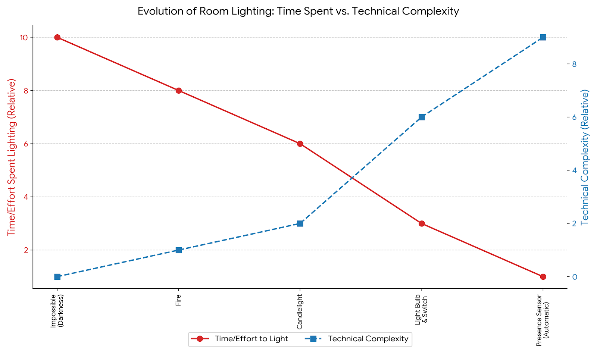
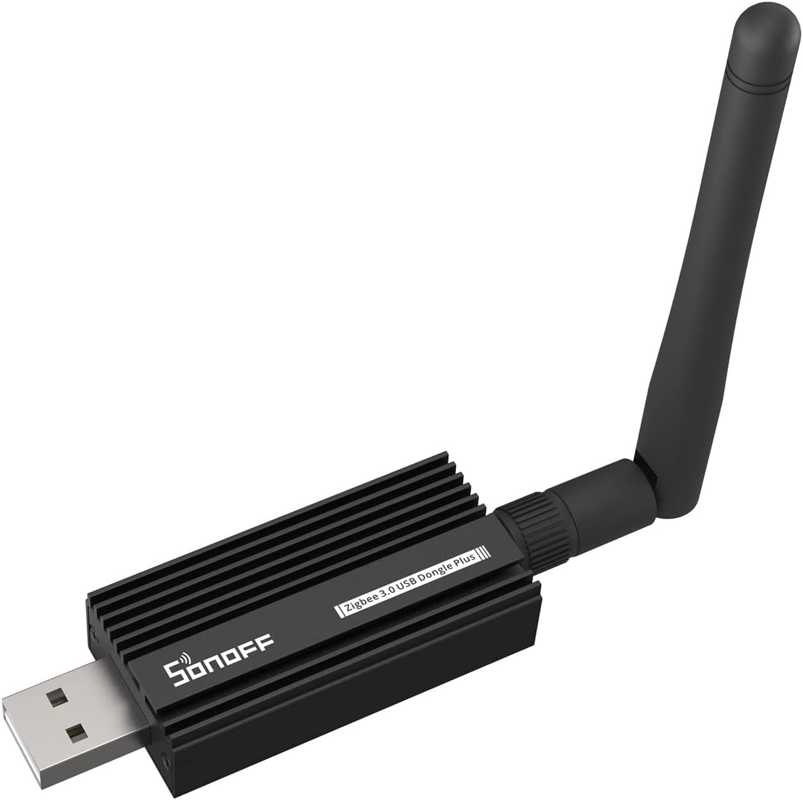
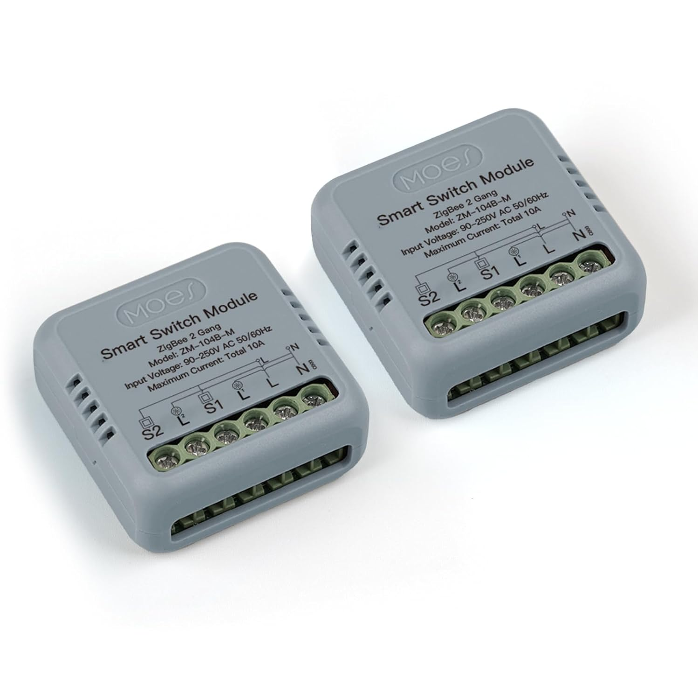
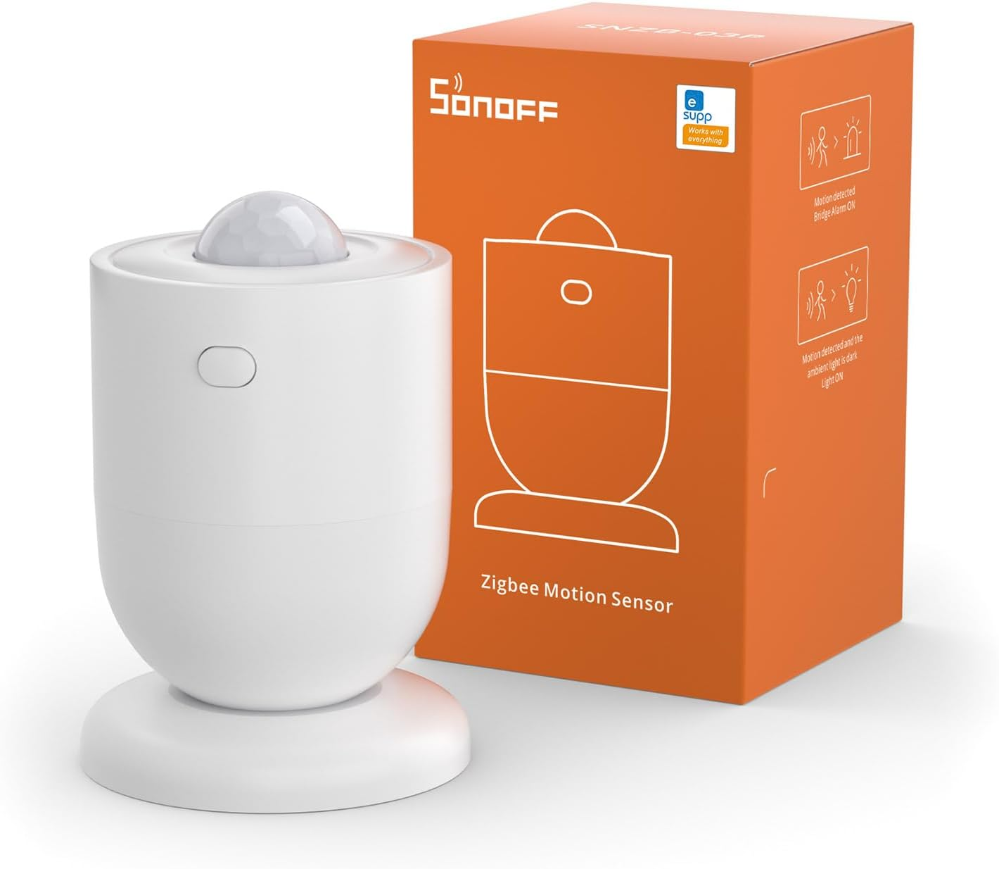
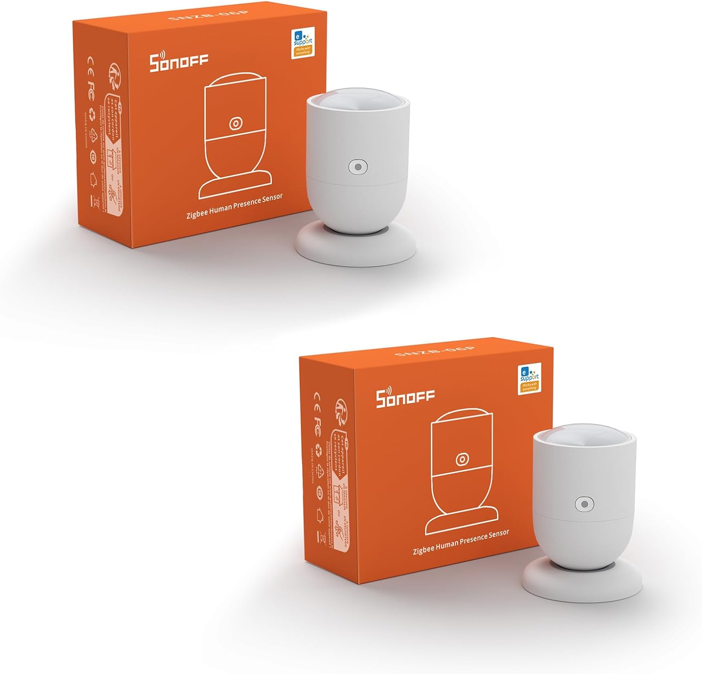
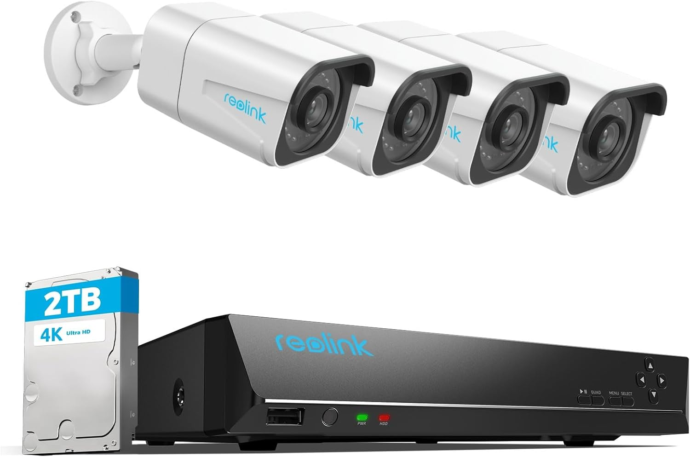
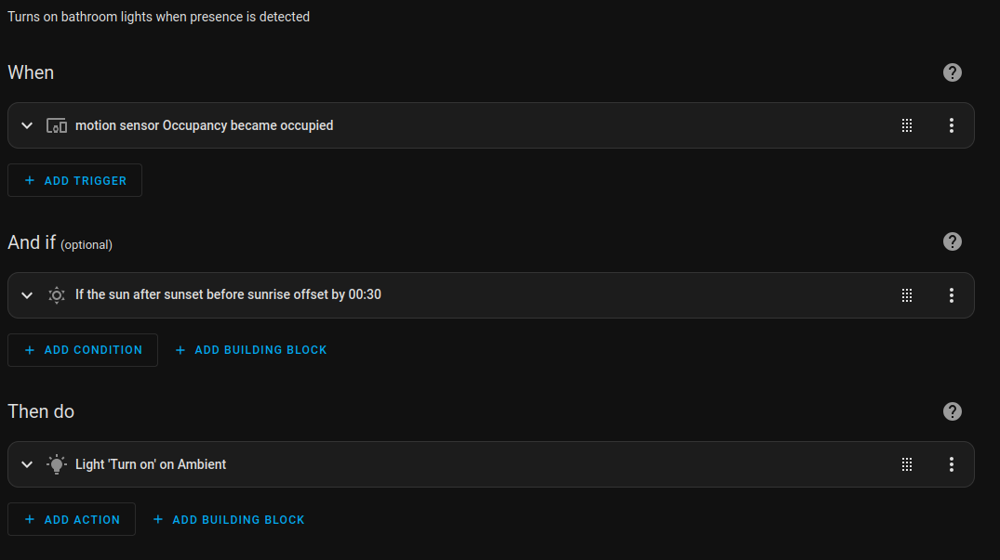

# Why

*In today's post, I want to explore my journey with HomeAssistant and how I'm
using it to explore 'user house interaction' – aiming to create a home where essential
tasks manage themselves, almost invisibly.*

I would classify myself as a visual minimalist of sorts. I don't mind
complicated things, but the user has to be unaware of the technology that allows
a given thing to happen.

Let's go through a thought experiment. Imagine someone wants to have light in
their room. Not so long ago, this was accomplished with candles. Candles in turn
were replaced by more complex electrical systems with light bulbs and switches.
In doing so, its use became simpler. Simply tap a switch to turn on the light.
Technology enabled this transition. The initial work a user had to go through to
accomplish their final goal (Having a lit room) was reduced, essentially
simplifying the user's interaction with the "System".

With this in mind, what would be the perfect interaction with any system? One
might arrive at the conclusion that thinking of the outcome one wants to
accomplish and the necessary events being performed would be perfect. However,
imagine that thinking about turning the light on would turn the light on. At the
speed of our thoughts, lights would be turned on and off all the time, even left
on forever, not to mention the mental overhead that this would impose on the
system's user.

We are on the right track, but let's give this a second thought. We know that
making the system disappear would be to follow the trend of increased
technological complexity and decreased user interaction complexity.

What if we could turn on the light whenever the light needed to be turned on,
without the user even having to think about it? This would be a significant
advancement in current light-user interaction.

If we follow this thought, we could conclude that **the best system is an
invisible system to the user, and the best interaction a user can have with this
system, is none at all.**

This is my goal with HomeAssistant. To allow the user to forget these systems
exist in the first place. However, users also require control, so we have to
keep the switches... For now. I envision a time in which switches won't be
necessary, but we are not there yet.

**So, with that philosophy hammered out, how did I actually start piecing this
together? It all kicked off with selecting the foundational bits and pieces.
Here's the rundown on my choices:**

# What

## Hardware

My budget allowed for an Intel N100 MiniPC. Since I started this project
primarily for HomeAssistant, this PC was sufficient and a realistic choice. If I
end up hosting more applications than my **BeeLink MiniPC** can handle, I will
probably buy a second one.

## Proxmox, Docker or Kubernetes

I had to choose between using Docker, Kubernetes or Proxmox. Most applications
are not prepared to run on Kubernetes, so, although I still want to have a
Kubernetes cluster for tinkering, this was not its moment. Docker became an
option, but the same limitation arose, especially in managing the Windows OS I
needed for Reolink camera management software. This really left me with one
viable option: **Proxmox.**

With Proxmox I could even create a Kubernetes cluster, have a Windows VM, and
run containerized applications if needed. There is also a trend in the
self-hosted community to use Proxmox.

## Access

To access our HomeAssistant instance, I use **CloudFlare reverse tunnels.**
Previously I used Tailscale. Although it's a great product, it was eating at my
and my partners phone battery.

## Protocols

Here is a breakdown of the 5 most used protocols and their pros and cons.

| Feature                                       | Wi-Fi | Matter | Zigbee | Z-Wave | Thread |
| :----------------------------------------------- | :---: | :----: | :----: | :----: | :----: |
| **High Bandwidth** |  ✅   |   ✅   |   ❌   |   ❌   |   ❌   |
| **Pre-existing Home Network** |  ✅   |   ❌   |   ❌   |   ❌   |   ❌   |
| **No Dedicated Hub Usually Needed** |  ✅   |   ❌   |   ❌   |   ❌   |   ❌   |
| **Long Market Presence** |  ✅   |   ❌   |   ✅   |   ✅   |   ❌   |
| **Aims for Universal Device Interoperability** |  ❌   |   ✅   |   ❌   |   ❌   |   ✅   |
| **Security as Foundational Pillar** |  ❌   |   ✅   |   ❌   |   ❌   |   ✅   |
| **Prioritizes Local Network Operation** |  ❌   |   ✅   |   ✅   |   ✅   |   ✅   |
| **Backed by Major Tech Consortia** |  ✅   |   ✅   |   ✅   |   ✅   |   ✅   |
| **Optimized for Very Low Power** |  ❌   |   ✅   |   ✅   |   ✅   |   ✅   |
| **Associated with Generally Lower Hardware Costs** |  ✅   |   ❌   |   ✅   |   ❌   |   ❌   |
| **Designed for Many Devices (Scalability)** |  ❌   |   ✅   |   ✅   |   ✅   |   ✅   |
| **Commonly Uses Sub-GHz Frequencies** |  ❌   |   ❌   |   ❌   |   ✅   |   ❌   |
| **Strong Certified Intra-Interop** |  ❌   |   ✅   |   ✅   |   ✅   |   ✅   |
| **Native IPv6 for End Devices** |  ✅   |   ✅   |   ❌   |   ❌   |   ✅   |
| **Inherent Mesh Networking** |  ❌   |   ✅   |   ✅   |   ✅   |   ✅   |

For my base network of lights and critical sensors, I decided to go with Zigbee,
as it had been on the market for a long time and was generally less expensive
than Z-Wave devices. I had no issue finding options for devices I wanted. I also
did not want to use Wi-Fi as its underlying communication network, because I did
not want to run the risk of saturating the network or being open to any
vulnerability these devices would potentially have. I also wanted to create a
mesh network because device communication will be more resilient, contributing
to a system that 'just works' reliably without intervention.

## Hub

There are many hubs out there, especially from many different smart home brands.
My recommendation is to buy the **SONOFF ZBDongle-E**. It has worked well for every
Zigbee device I have bought.

## Lights

There were three types of devices I could use:

1.  Integrated light switches (Expensive and not a lot of styles available)
2.  Light switch modules that would fit in junction boxes
3.  Individual light bulbs

I decided to choose the **Moes Zigbee 2-gang** light switch modules because they
do not interfere with the switch style, which is significant for a home, and I
get to choose exactly what light bulb I want. The other, most important factor
is that they are cheaper than dedicated light switches and light bulbs, as you
can even control two lights from the same device.

## Presence sensors

| Feature                                     | Motion Sensor (e.g., PIR) | Presence Sensor (e.g., mmWave) |
| :---------------------------------------------- | :-----------------------: | :----------------------------: |
| **Detects Walking/Large Movements** |            ✅           |               ✅               |
| **Detects Minor Movements (e.g., hand wave)** |            ✅           |               ✅               |
| **Detects Stationary Occupancy (Still Person)** |            ❌           |               ✅               |
| **Detects Micro-Motions (e.g., breathing)** |            ❌           |               ✅               |
| **Typically Lower Power Consumption** |            ✅           |               ❌               |
| **Generally Lower Purchase Cost** |            ✅           |               ❌               |
| **Provides Richer Data (e.g., position, count)**|            ❌           |               ✅               |

For the bathroom, I use **Sonoff Zigbee motion sensors** because they are generally faster to
detect motion. It is true that they provide two readings. One (Motion) is static all the
time. I believe its some kind of bug, so I use the Occupancy sensor, which does
the job perfectly.

In the office I use presence sensors, as I will be in a
static position for long periods of time and require stationary occupancy
detection.

## CCTV system

**Reolink** kept coming up on Reddit as the best all-around camera system for the
home. I wanted a local-only camera system. I wanted to ensure the footage would
not be stored on a company's servers all the way in another country.

I treated this part of the build as the most security-focused project.

There is not much use for a completely secure system if I cannot use it or
integrate it with my existing tools, so I made sure these Reolink cameras had
integration with HomeAssistant and could differentiate between animals, people,
motion, or vehicles.

Finally, I bought 4 PoE Reolink cameras that connect to a Reolink NVR via
Ethernet. This NVR has a statically assigned IP address in a CCTV-specific
subnet that does not have access to the Internet. But more on this in another
post.

To manage the cameras and the overall alarm system of the house, I used Alarmo.
It's a great project that allows for multiple modes, areas, and sensors, and has
actions that trigger on a given event. Depending on the alarm mode and the area,
a specific action gets triggered.

# How

I want to focus on the ideas and general purpose rather than the technical
aspect of the build. AI can guide anyone interested in building a project
similar to this step-by-step.

We have already gone through what would be my end goal in creating the perfect
smart home in the light example.

> We could conclude that the best system is an invisible system to the user, and
  the best interaction a user can have with this system, is none at all.

What follows is a set of ideas and automations that have taken me closer to that
goal.

## Lights

In order to turn on the lights, I use presence and motion sensors, depending on
where they are going to be placed and what they will be used for.

Motion sensors are faster to trigger, so the bathroom is configured to switch on
the light if the motion sensor detects motion and it's dark outside. I map
outside darkness with sunset and a negative delay.

I have mapped most of my lights to sunrise and sunset with a certain threshold
before or after, depending on the light's use. I have found that it makes the
most sense given the variable nature of sunrise and sunset hours where I live.

With these simple automations, we have configured the house lights to a point
where we rarely touch a switch and have forgotten they exist.

## Alarm system

The automations around the alarm system are somewhat more complicated than the
lights, especially around triggering the alarm.

We wanted to have a physical place where we could turn on or off the alarm, kind
of like commercial alarm systems that have a display and a key, and allow you to
turn on or off the alarm from there.

I bought an NFC tag and mapped it to a script that enabled or disabled the alarm
when a device from a list of allowed devices came into its communication field.

The key here is that a single NFC chip could perform both actions and also
ensure that a third party could not enable or disable the alarm unless
authorized to do so.

The NFC chip was then placed inside one of the wall outlet switches in order to
hide it completely from sight. In this instance, some human action is needed,
but I'm thinking about removing this action completely. The easy way would be to
enable or disable the alarm based on HomeAssistant's "at home" integration, but
I'm not completely sold on that option, as it needs access to our location,
which I'm not a fan of.

Regarding Alarmo, the integration is very well thought out. Honestly, it
requires some time to get used to its configuration options, but I can tell it's
a mature piece of software.

Regarding integrations, I have two associated areas: the inside of the house,
called "house", and the terrace, called... "terrace".

Depending on the area where the sensor gets triggered, a specific behavior can
be programmed to happen.

For example, I will have my home call me and my partner on our phones using the
HomeAssistant Twilio integration if any of my home presence sensors are
triggered, but not if my garden presence sensors are triggered, as we believe
the event is not as important. Depending on the alarm mode, if the garden
presence sensors are triggered, an alarm bell will ring so that whoever is
around the house understands they are trespassing.

Another interesting feature is the trigger time. You can decide the length of
time the alarm remains in the triggered state. I use this to automate actions
for an event. If the alarm is in night mode and the garden sensors detect human
presence, as an action, the garden lights get turned on, and after 5 minutes,
they get turned off again.

Apart from the actions, Alarmo can be enabled and disabled when specific events
are triggered. As I said before, I am working on having my alarm set up so that
it activates when both me and my partner leave the house and gets disarmed when
at least one of us is home and it is sunrise.

# Conclusion

As you can see, I want to integrate technology as tightly as I can at home, but
I want to make it transparent. A good job goes unnoticed.

HomeAssistant is a fantastic piece of software and is designed to be easy to use
and accessible to anyone who is willing to spend some time researching and
building out the system. What I like most about it is that it is infinitely
customizable and can really be used as the only app you need to manage the whole
house, leaving behind those days of multiple applications.
